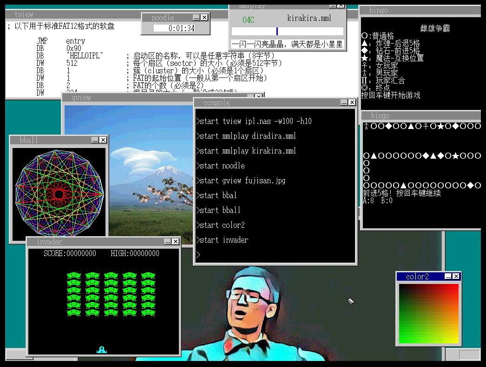

# MyOS
　　趁着暑假，跟着《30天自制操作系统》写一个操作系统，一定可以学到很多相关知识，并且对操作系统有一个更深入的了解。 
　　终于看完了这本书，最后自己写了一个小游戏bingo。 
　　这本书，作者也是带着玩的心态给读者讲，他也希望读者为了好玩一起编一个小小的操作系统。跟着作者大致了解了一下操作系统后，对自己的编程思想也有一定的冲击。当更了解底层实现后，编程也变得不再那么神秘。之前都是在用人家写好的API来进行应用程序的编写，如今自己也跟着作者了解了一下API的编写，还要考虑系统保护，内存分配，对计算机也有了全新的了解。 
　　这只是个开始！以后更要努力！  
