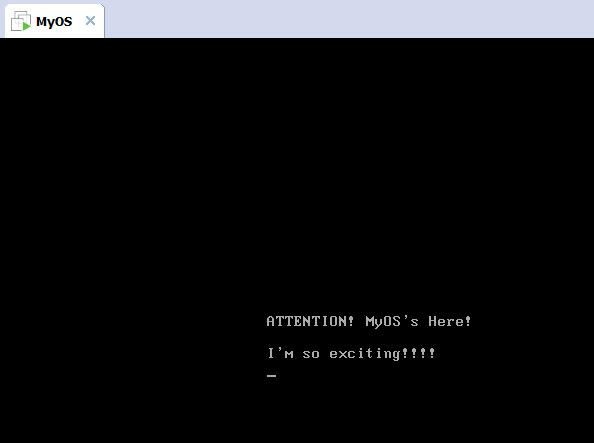

# MyOS开发第一天 #

　　因为书出版的比较早了，现在软盘已经淘汰，所以真正的实机操作已经不太现实。不过幸好有虚拟机，这下连往软盘里下载程序这一步都免了。直接在VMware里面新建一个空操作系统，然后加载一个软盘，直接指定一下自己的操作系统（.img）的位置，选择开机自动加载，一开机就会运行起自己的操作系统！我给自己的操作系统起了一个很普通的名字：MyOS。 
　　首先是非常简单的，只能打印一些字符的“操作系统”，作者已经写好。刚开始是二进制的，然后是汇编的，到了汇编的时候，对于我们这些初学者才有了定制的机会，可以打印一些自定义的东西了！ 
　　当编译打包汇编文件时，作者已经准备了tolset，因为我把tolset的位置变动了一下，所以我修改了一下作者的asm文件 
    
	..\..\tolset\z_tools\nask.exe MyOS.nas MyOS.img

　　对于显示部分，我自定义了一下：

    	DB		0x0a, 0x0a		   ; 相当于\n\n
		DB		"ATTENTION! MyOS's Here!"
		DB		0x0d, 0x0a ,0x0a   ; \r\n\n
		DB      "I'm so exciting!!!!"
		DB		0x0d, 0x0a		   ;\r\n
		DB		0

