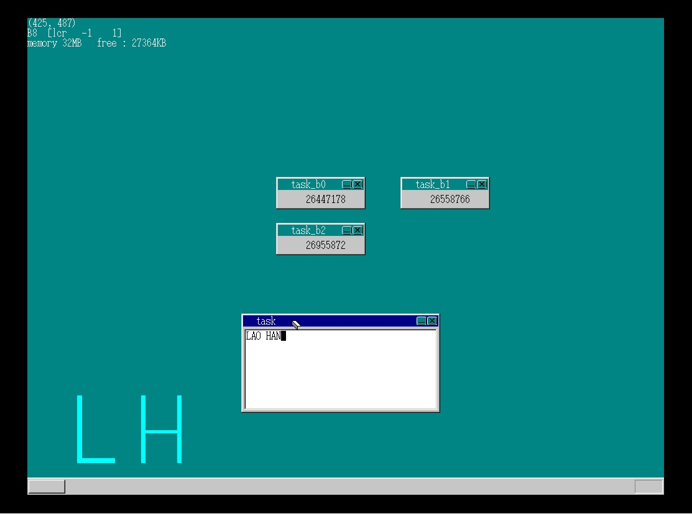
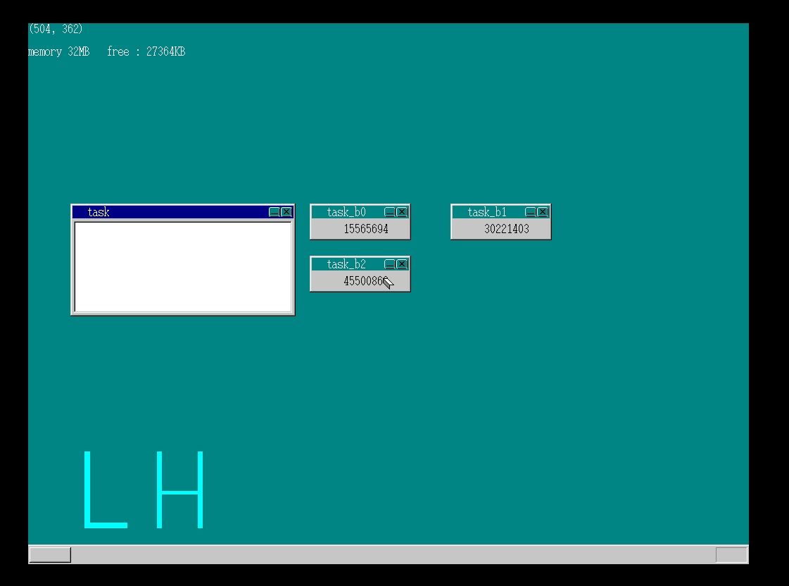

#MyOS第七天#
###书上day16###
　　真正聪明的并发一定不会平等的看待每个任务，任务也一定有轻重缓急，于是便有了优先级，而复杂的使用环境决定了仅仅设置优先级还是无法满足需求，于是有了更进一步的任务等级，首先分出level，level中又细分优先级，CPU总是优先处理那些更紧急或者更影响体验的任务，这也是充分利用CPU能做的极限了。  
　　把鼠标、键盘及刷新屏幕的level设置为比计数页面高时，一旦有鼠标、键盘及屏幕刷新事件时，则忽略计数页面，本来优先级不同的计数页面速度大幅下降并趋于一致：   
　　当没有鼠标键盘屏幕刷新事件发生时，计数页面的速度提升，并且优先级也体现出来：  
　　到此，任务并发功能也就趋于完善了。