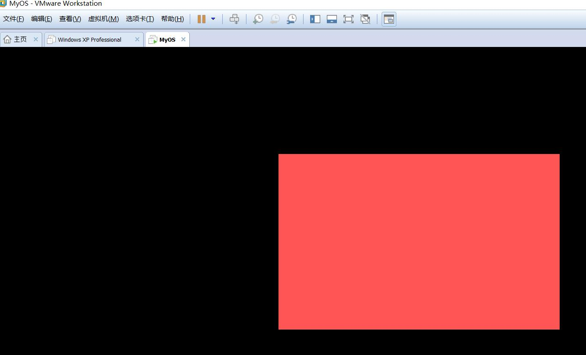
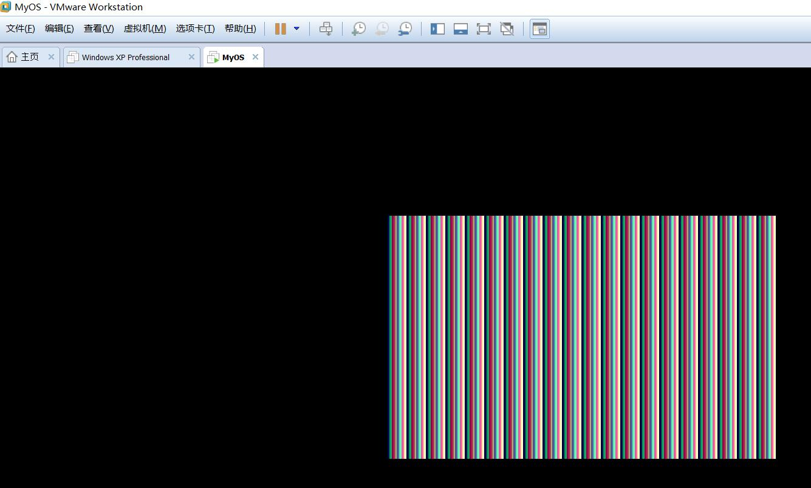
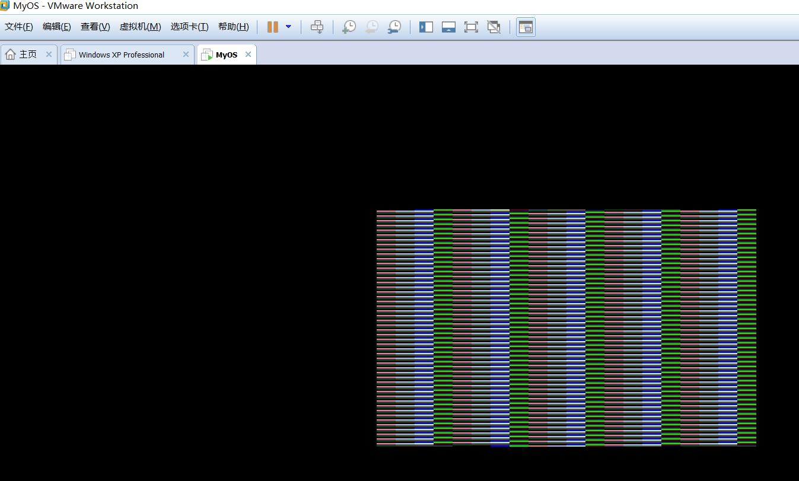
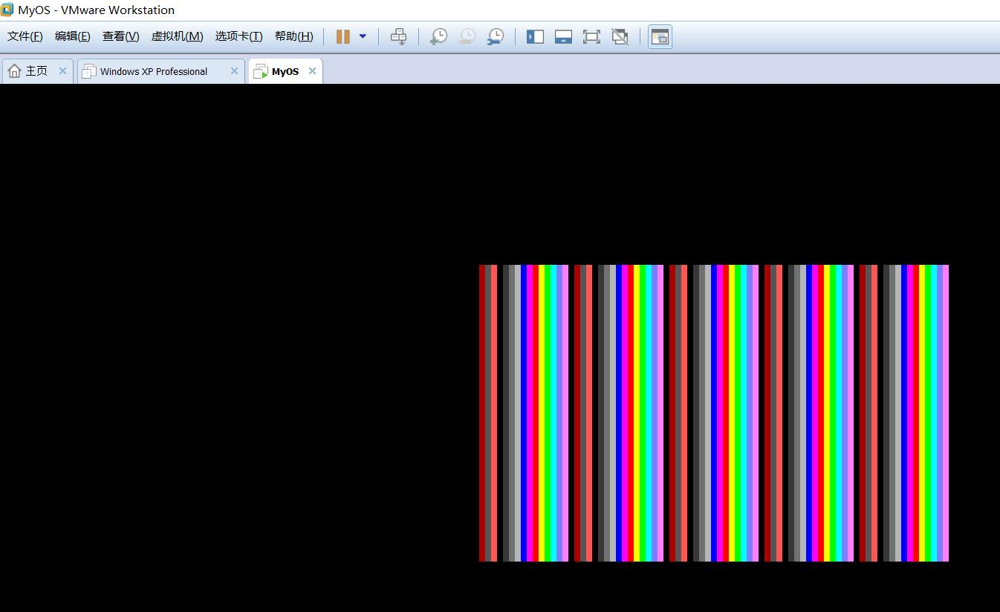
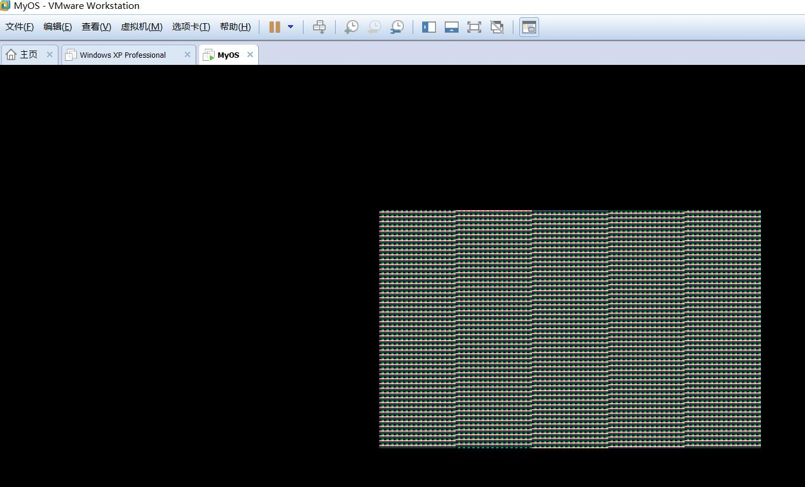
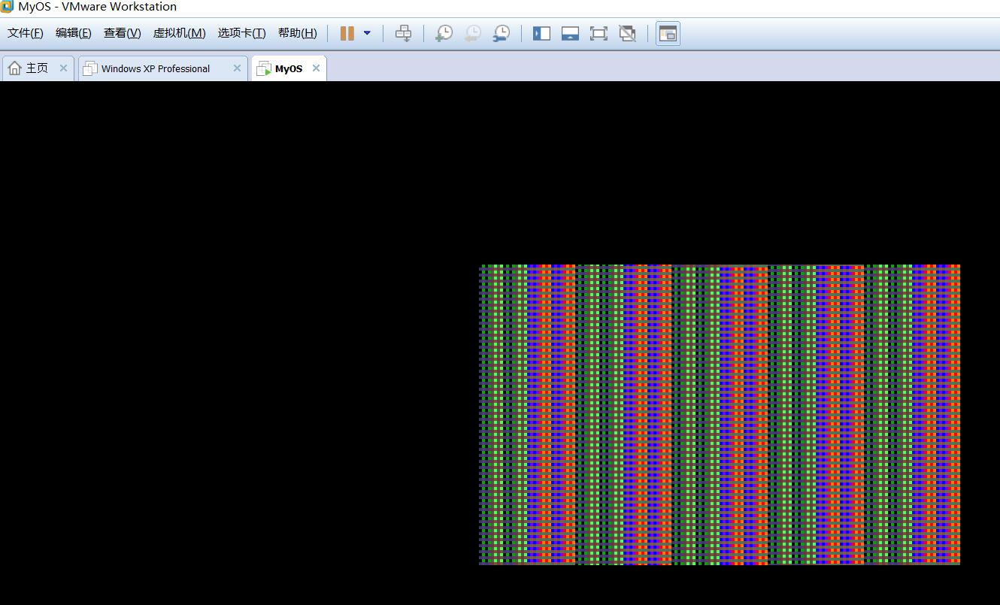
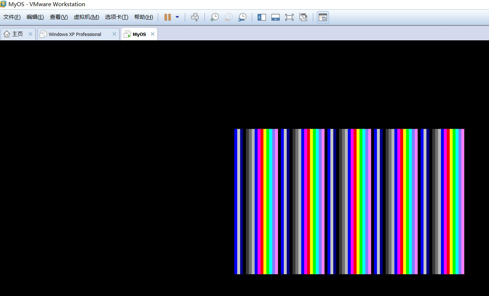
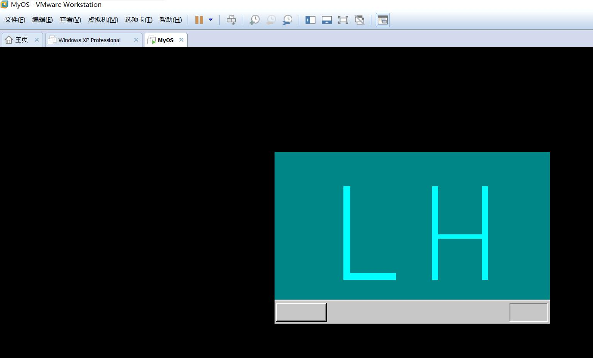
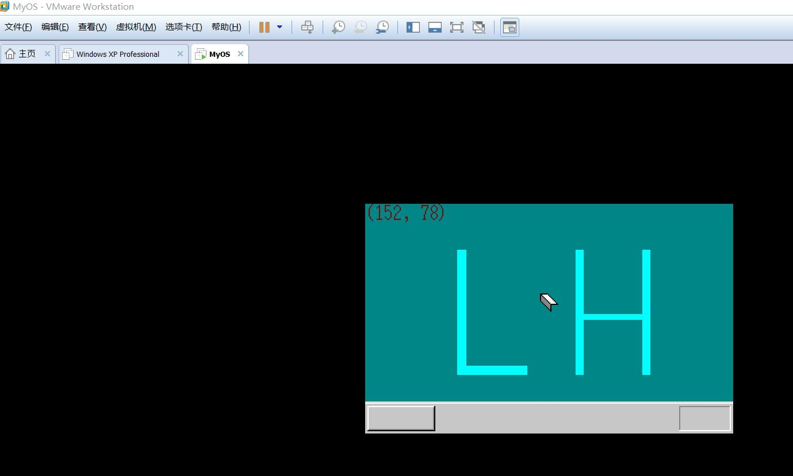
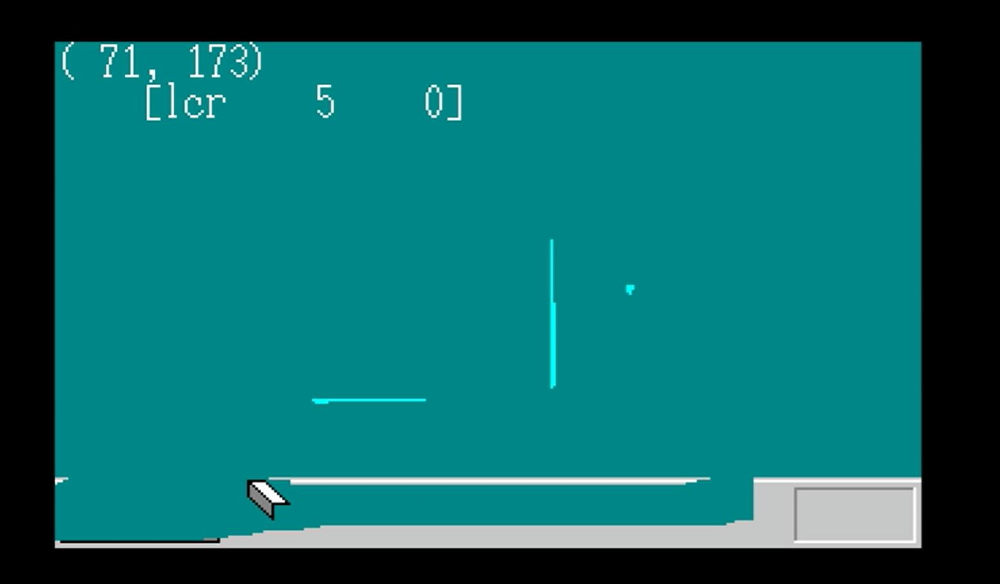

#MyOS第三天#

###书中day04###

　　慢慢的开始有趣了起来。让我来吧全屏变成粉红色吧！  
  
　　从网上查到了彩色显卡四位二进制数表示的十六中颜色：

<table style="width: 80%;" class="gen" align="center" border="2" cellpadding="0" cellspacing="0">
<tbody>
<tr align="center">
<td class="field" width="15%">二进制数</td>
<td class="field" width="15%">颜色</td>
<td class="field" width="20%">例子</td>
<td class="field" width="15%">二进制数</td>
<td class="field" width="15%">颜色</td>
<td class="field" width="20%">例子</td>
</tr>
<tr align="center">
<td class="cellgen">0000</td>
<td class="cellgen">黑色</td>
<td class="cellgen" style="color: black;">black</td>
<td class="cellgen">1000</td>
<td class="cellgen">灰色</td>
<td class="cellgen" style="color: #808080;">gray</td>
</tr>
<tr align="center">
<td class="cellgen">0001</td>
<td class="cellgen">蓝色</td>
<td class="cellgen" style="color: #000080;">blue</td>
<td class="cellgen">1001</td>
<td class="cellgen">淡蓝色</td>
<td class="cellgen" style="color: #0000ff;">light blue</td>
</tr>
<tr align="center">
<td class="cellgen">0010</td>
<td class="cellgen">绿色</td>
<td class="cellgen" style="color: #008000;">green</td>
<td class="cellgen">1010</td>
<td class="cellgen">淡绿色</td>
<td class="cellgen" style="color: #00ff00;">light green</td>
</tr>
<tr align="center">
<td class="cellgen">0011</td>
<td class="cellgen">青色</td>
<td class="cellgen" style="color: #008080;">cyan</td>
<td class="cellgen">1000</td>
<td class="cellgen">淡青色</td>
<td class="cellgen" style="color: #00ffff;">light cyan</td>
</tr>
<tr align="center">
<td class="cellgen">0100</td>
<td class="cellgen">红色</td>
<td class="cellgen" style="color: #800000;">red</td>
<td class="cellgen">1100</td>
<td class="cellgen">淡红色</td>
<td class="cellgen" style="color: #ff0000;">light red</td>
</tr>
<tr align="center">
<td class="cellgen">0101</td>
<td class="cellgen">紫红色</td>
<td class="cellgen" style="color: #800080;">magenta</td>
<td class="cellgen">1101</td>
<td class="cellgen">淡紫红色</td>
<td class="cellgen" style="color: #ff00ff;">light magenta</td>
</tr>
<tr align="center">
<td class="cellgen">0110</td>
<td class="cellgen">棕色</td>
<td class="cellgen" style="color: #808000;">brown</td>
<td class="cellgen">1110</td>
<td class="cellgen">黄色</td>
<td class="cellgen" style="color: #ffff00;">yellow</td>
</tr>
<tr align="center">
<td class="cellgen">0111</td>
<td class="cellgen">银色</td>
<td class="cellgen" style="color: #c0c0c0;">light gray</td>
<td class="cellgen">1111</td>
<td class="cellgen">白色</td>
<td class="cellgen" style="color: #ffffff;">white</td>
</tr>
</tbody>
</table> 
　　这篇文章介绍了INT 10H的各种用法：[http://www.cnblogs.com/magic-cube/archive/2011/10/19/2217676.html](http://www.cnblogs.com/magic-cube/archive/2011/10/19/2217676.html)   

　　再来一个条纹的，哈哈~  

> ####i&0f####

>####i&f0####

>####i&3c####

>####i&c3####

>####i&aa####

  
### 使用调色板自己调色后的条纹 ###
>####i&3c####

  
###终于进入图形界面了！！！！###
  

### 我的定制鼠标图标 ###

  
##day08看到一半了，鼠标已经动起来了，但还是个橡皮擦。##
  

