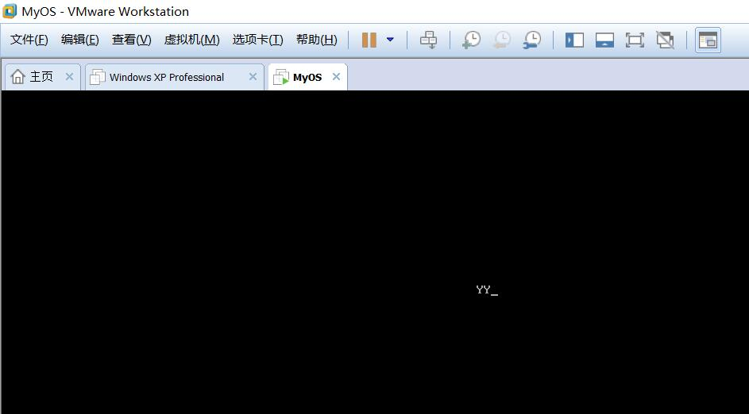
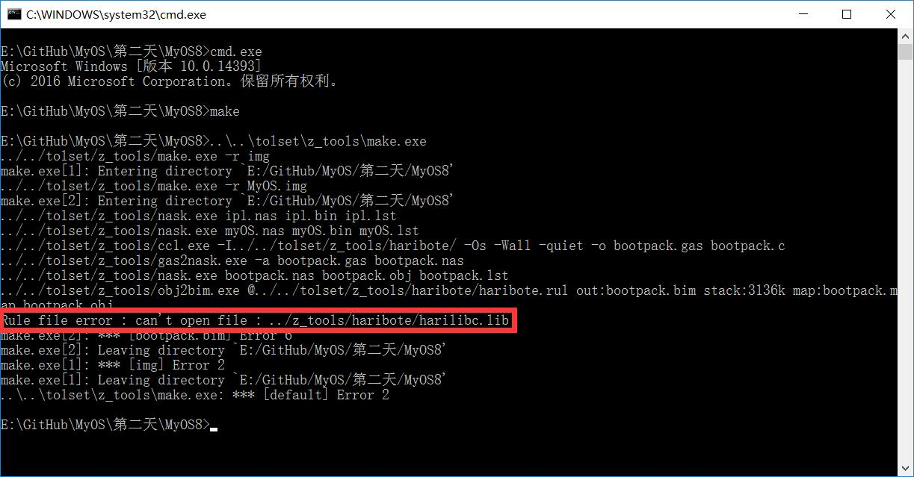

# MyOS开发第二天 #
### 书中day03 ###
　　结束了引导盘的编写，终于开始运行一些程序了。调用BIOS显卡显示两个字符吧。 

　　今天的内容都是关于读软盘，以及把系统加载到内存中，都是汇编实现。今天网站备案成功，去搞了半天javaweb的运行环境的配置，还是没弄好，之前PHP哪有这么费力啊，明天再弄吧。

----------
之前我把tolset工具文件放在了系统源代码文件的外两层，配置了一下地址后，一直没有出什么问题，但是到今天引入C语言后出现一个莫名其妙的错误：

　　无论如何修改相关源码或工具文件中的路径都没有用，可能关系到权限相关的？或者是工具文件内部逻辑的限制吧。暂且把tolset文件夹复制过来一份吧。
　　后面是C语言了，会轻松有趣一点吧！