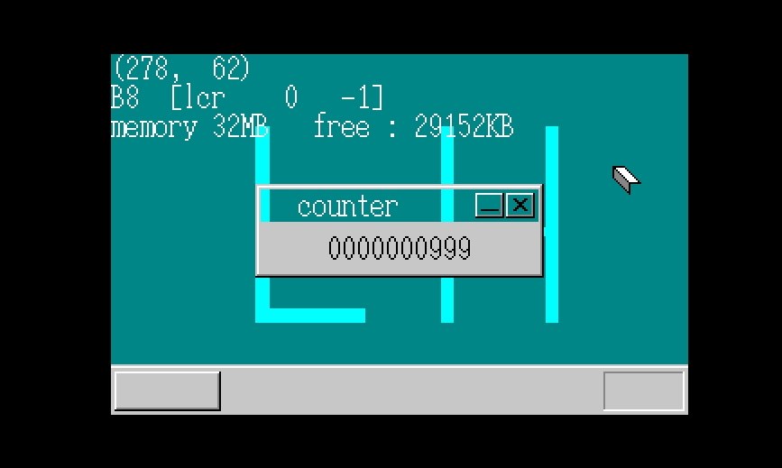

#MyOS第五天#
###书上day11###
　　画了个窗口，我把窗口的bar设置为透明色了，丑丑哒~  
  
　　另外还消除了显示的闪烁，闪烁是因为频繁的改写vram而造成的，其实这也是对资源的浪费，所以建立了类似缓冲的感觉，引入一个map来记录界面各处处于最高层的sheet的id，然后刷新vram时，只刷新变化层到各处最高层之间的像素点即可。很妙啊！  
###书上day12###
这部分内容是在弄定时器方面的东西，由一个定时器，到多个定时器，并且对定时器进行了类似sheets的优化，在让CPU尽量少做无用功的基础上完成多定时器的工作。