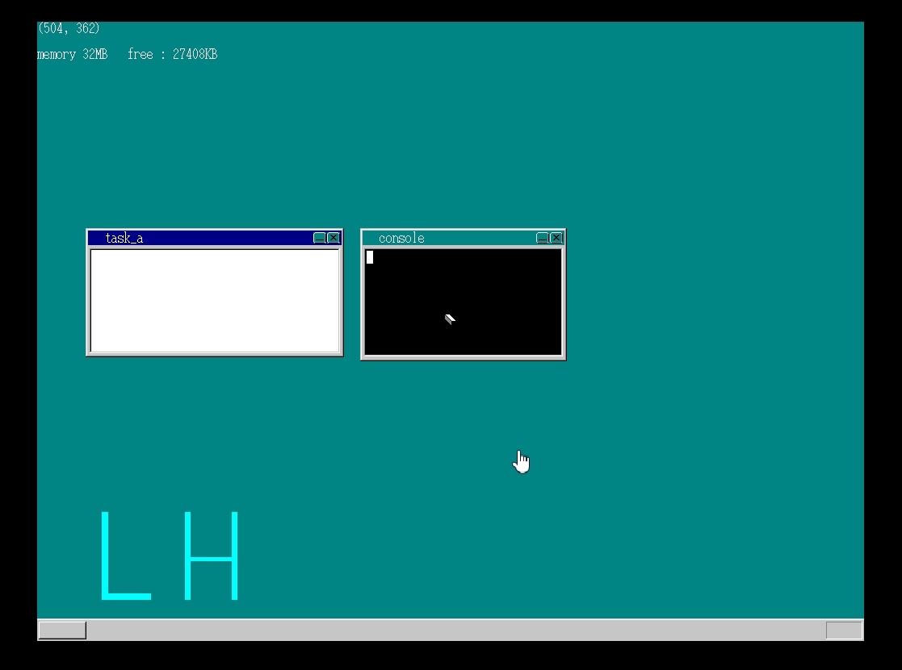
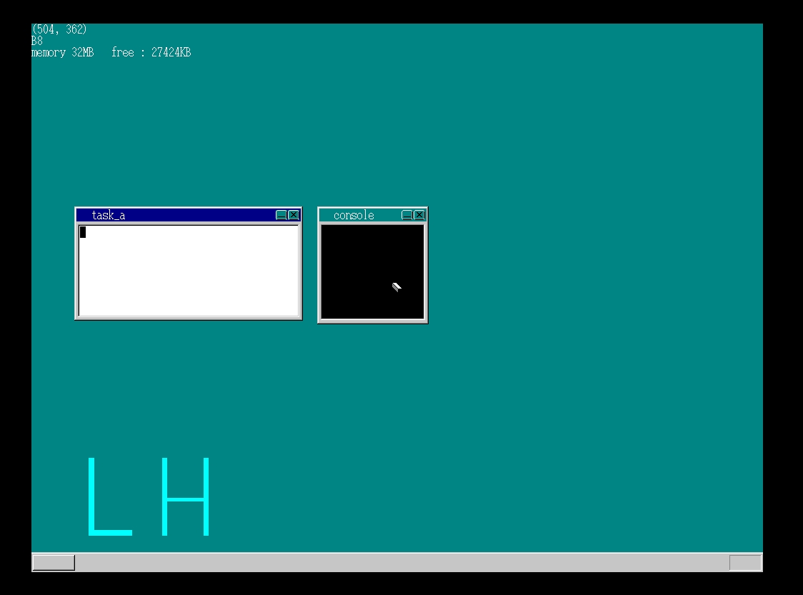
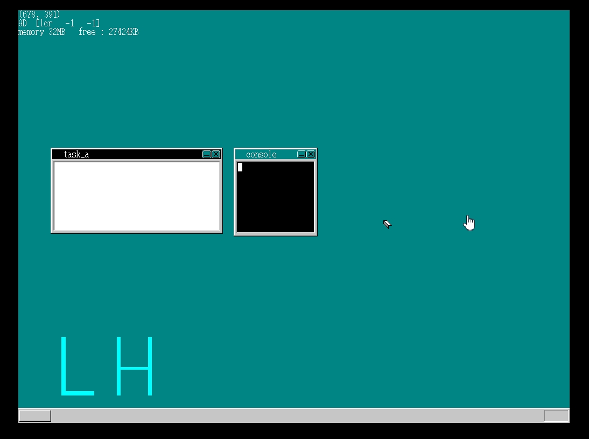
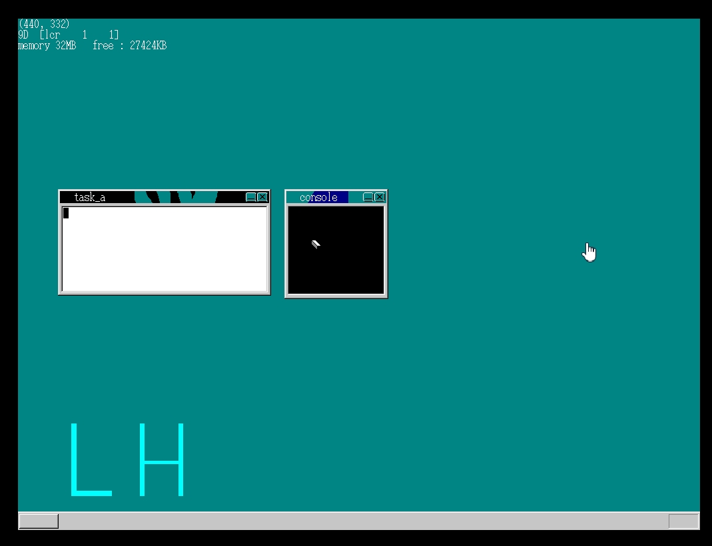
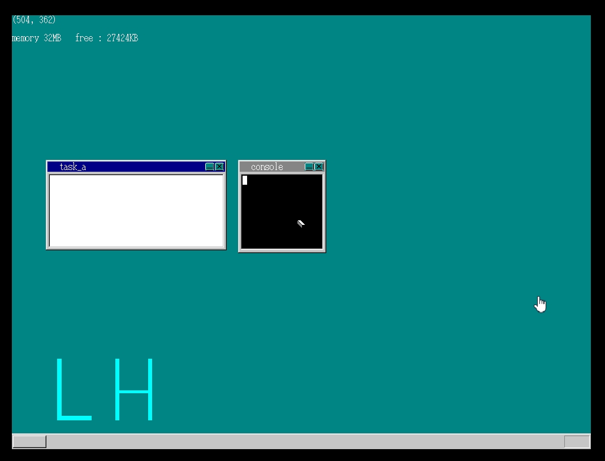
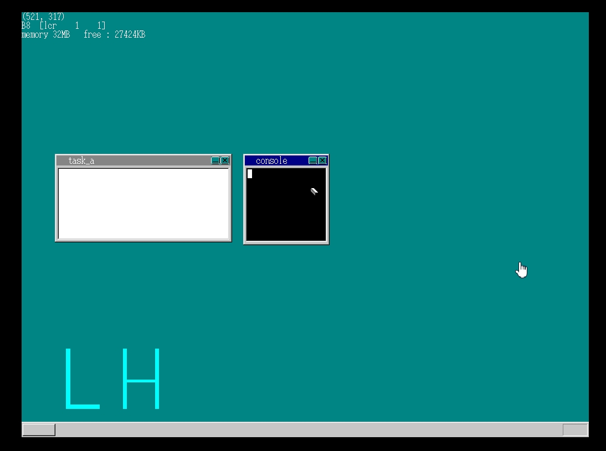
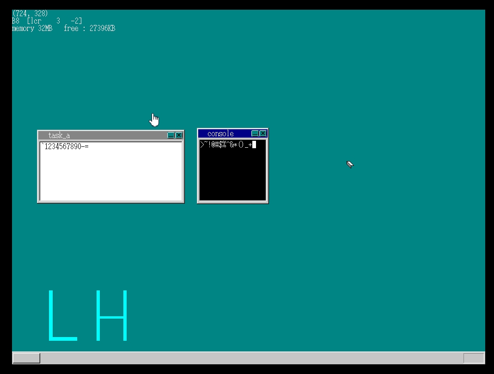

#MyOS第八天#
###书上day17###
　　要开发自己的命令行窗口了呢！开工了！  
　　本来窗口的标题栏我觉得透明色很酷，但是到这一处时，遇到了问题。当切换窗口时，标题栏颜色变化，如果有透明色的介入，便把该层sheet的下面非透明的sheet牵扯进来，然而关于屏幕刷新的机制，为了节省CPU开支，是刷新变化图层及以上，若牵扯进来下面的sheet的话，避免不了在两者之间权衡，需要改动的地方会比较多。于是我放弃了透明色，但是，标题栏中的“关闭”按钮和“最小化”按钮的透明色确实可以的，因为切换标题时不会牵扯到这里的颜色变化，所以不会将下面的sheet牵扯进来。

##标题栏设透明色时，切换后应该变为透明色的地方变为黑色，而当鼠标扫过后，扫过区域会达到预期的显示效果##
  
##放弃标题栏的透明色##

　　对键盘的大小写和字符的输入进行了适配，日本的键盘可能和国际的不同吧，或者是年代问题，我的键盘竟然与作者的键盘有些地方差别很大，不过我已经通过在虚拟机里面按键确认纠正了，各种字符的输入已经没有问题了！