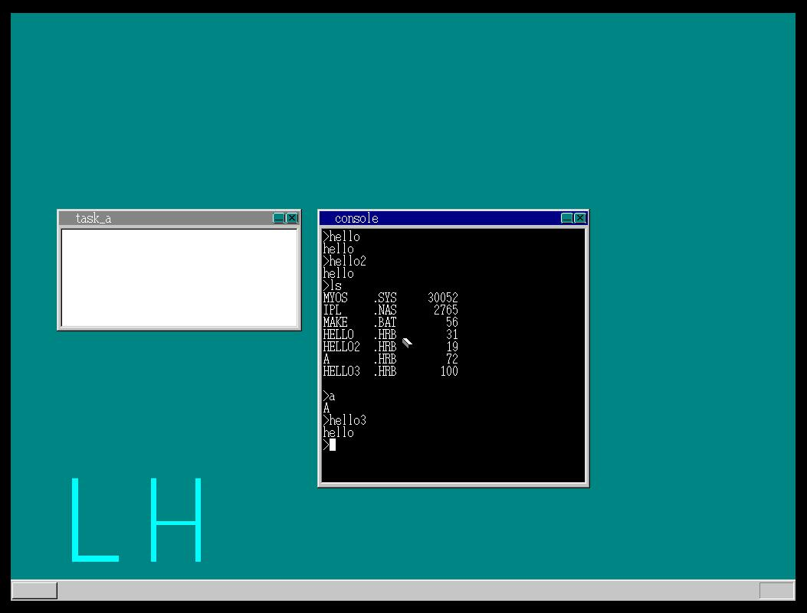
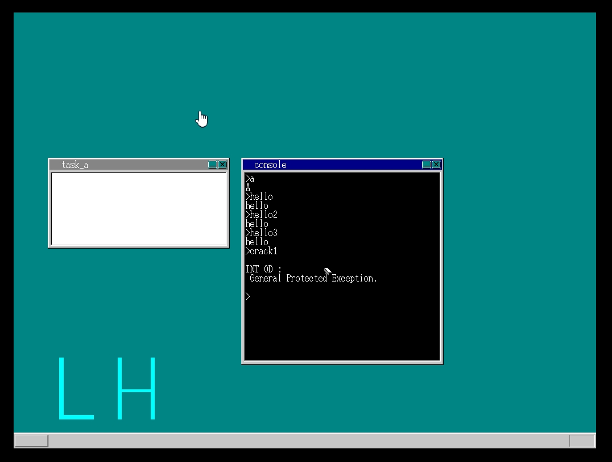
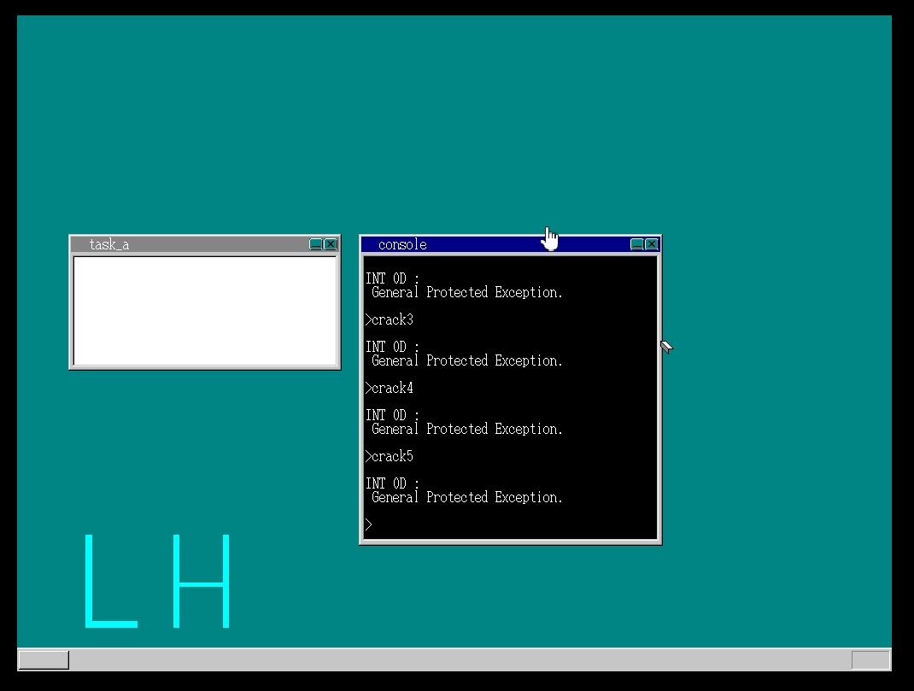
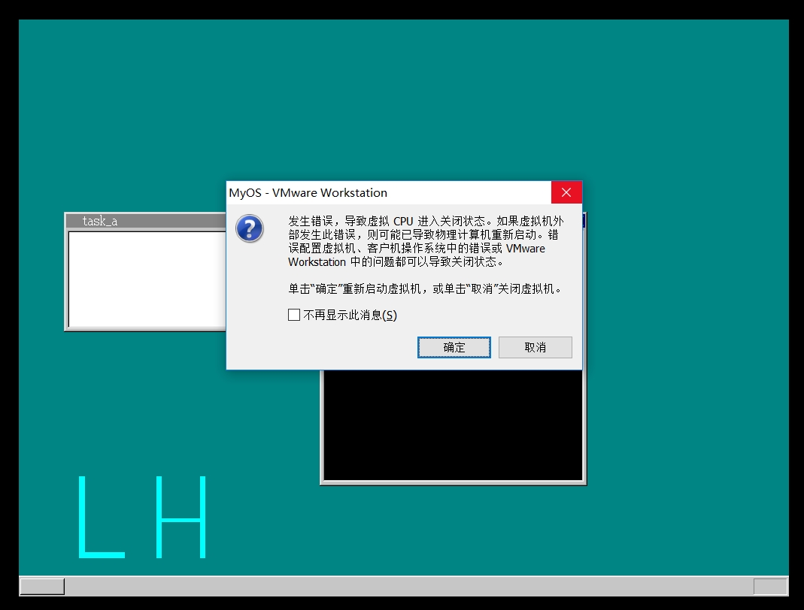
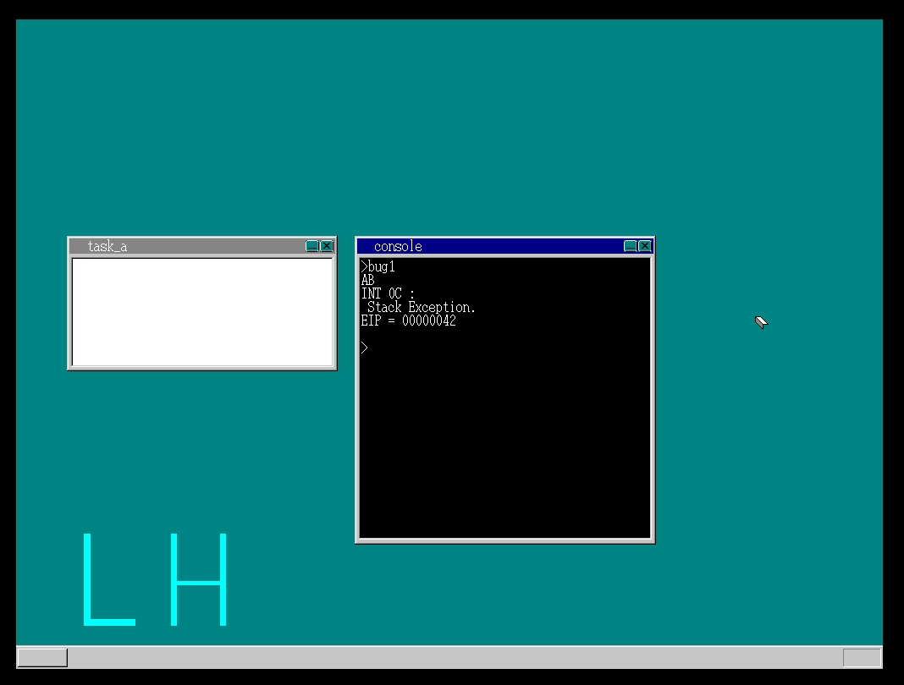
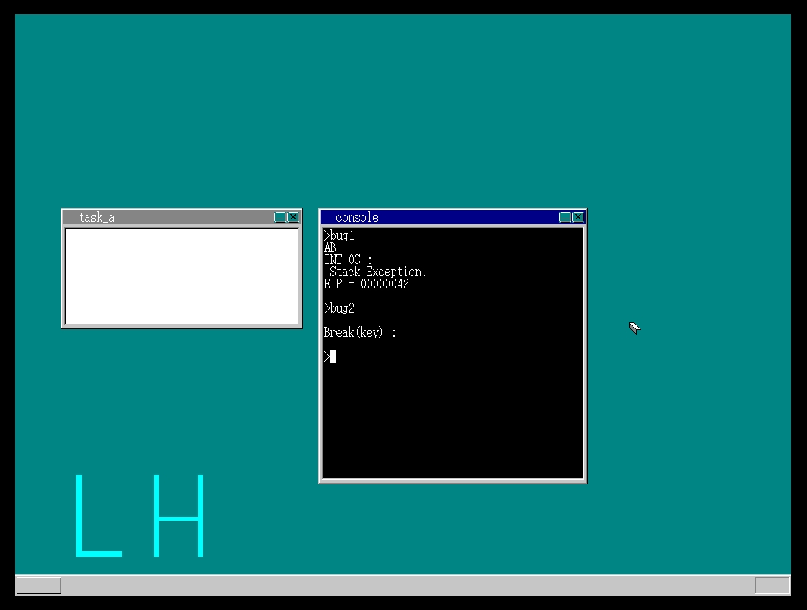
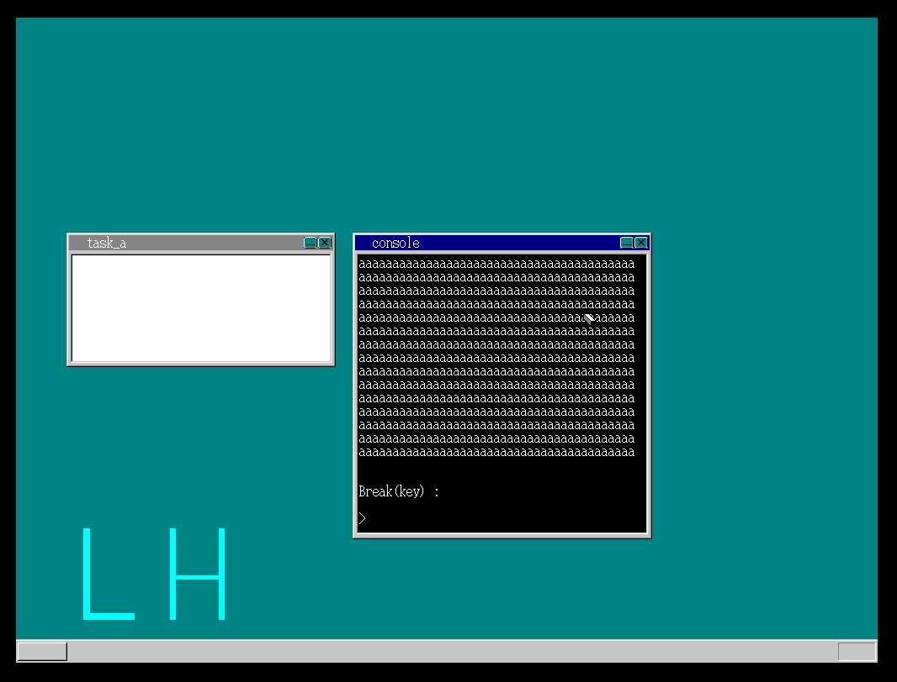
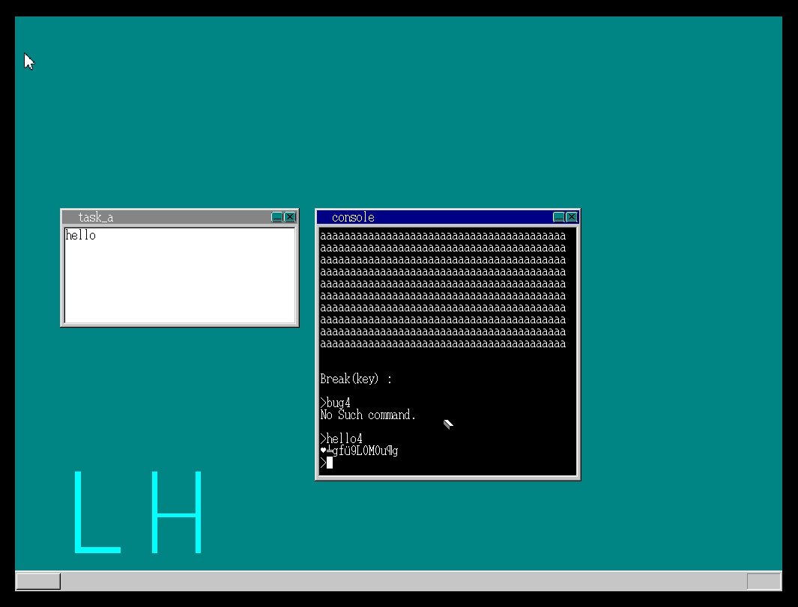
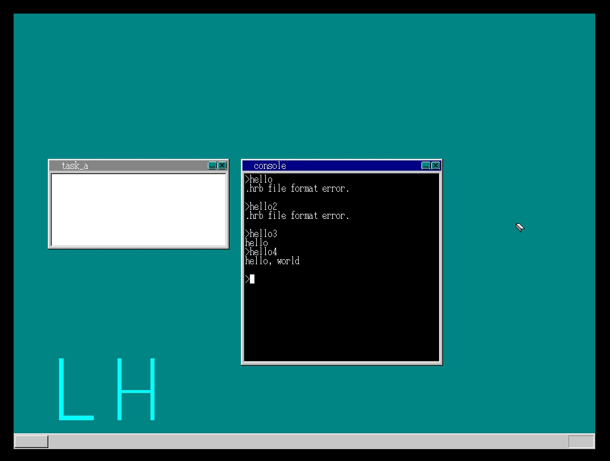
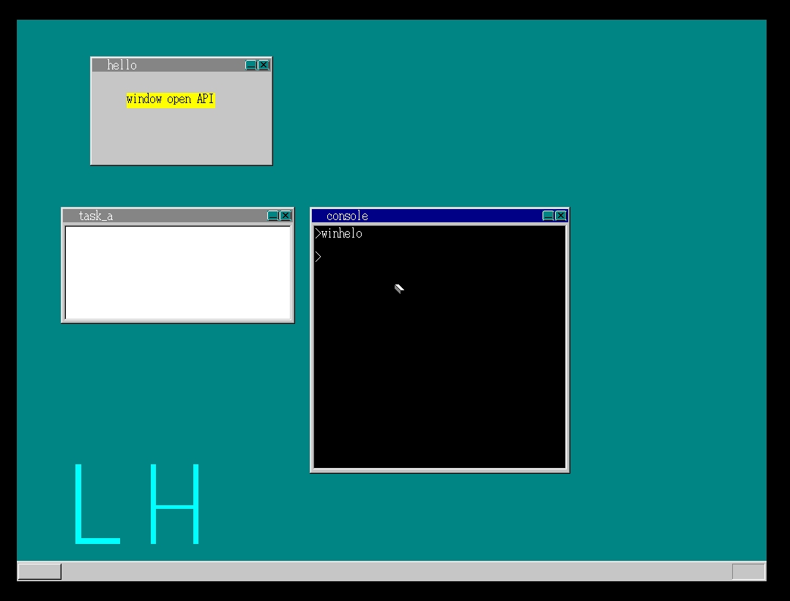

#MyOS第十二天#
###day21###
　　增加了对系统的保护，把系统用栈和应用程序用栈分开。
  
　　加入对异常的支持  
　　使用了CPU的内存保护功能后，百毒不侵  
###day21###
　　今天引入了栈异常，当程序侵犯不属于自己的栈空间的时候引发的异常，在配置栈异常中断前，作者的qemu没有捕捉到，但是我在VMware中捕捉到了，情况和作者在配置一场之后的情况一样，也是输出了“AB”之后报出异常。  
　　配置异常中断处理后，就不会像之前一样需要重启了！
  
##增加强制结束任务功能##
在linux中，习惯使用ctrl+c来停止任务，所以定制了一下,因为用到了ctrl，所以模仿shift增加了对ctrl的支持。  

    void HariMain(void){
	    /*省略*/
	    int key_ctrl = 0;
	    /*省略*/
	    while(1){
	    	/*省略*/
	    	if (fifo32_status(&fifo) == 0) {
	    		/*省略*/
	    	} else {
	    		/*省略*/
	    		if (256 <= i && i <= 511) {/*键盘*/
	    			/*省略*/
	    			if (s[0] != 0) { /* 一般字符 */
	    				if (key_to == 0) {	/* 发送给任务A */
	    					/*省略*/
	    				} else {	/* 发送到命令行窗口 */
	    					/*若按键为ctrl+c,则停止命令行的当前任务*/
	    					if (i == 256 + 0x2e && key_ctrl != 0 && task_cons->tss.ss0 != 0) {	/* ctrl + c */
	    						cons = (struct CONSOLE *) *((int *) 0x0fec);
	    						cons_putstr0(cons, "\nBreak(key) :\n");
	    						io_cli();	/* 关闭中断 */
	    						task_cons->tss.eax = (int) &(task_cons->tss.esp0);
	    						task_cons->tss.eip = (int) asm_end_app;
	    						io_sti();
	    					}else{
	    						fifo32_put(&task_cons->fifo, s[0] + 256);
	    					}
	    				}
	    			}
	    			/*省略*/
	    		}
	    	}
	    }
	}

　　第一次运行hello4时，因为没有复制应用程序数据段，作者是没有输出，而我的是输出了乱码  
　　修改console.c后，正常了，但是汇编文件编译出来的hello和hello2没有经过bim2hrb编译，所以就不能正常运行了。而bug系列也是c编译而来所以正常。往后汇编文件也需要先编译为bim文件，通过bim2hrb来编译。
  
　　继续完成窗口创建方面的API!

