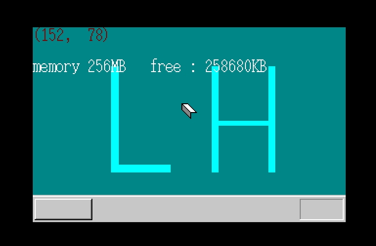

#MyOS第四天#
###书中day09###
　　今天一直在学内存管理相关的东西，鼠标的事暂时放下了，结果出来是猛地一看，256MB中有258680KB可用？空闲的比总的还大？一换算才发现256MB=262144KB。占用3464KB。  
  
　　当我在虚拟机上设置内存为32M=32768KB时，结果与作者一致，也是占用了3464KB的空间：    
　　完成界面叠加处理，鼠标的橡皮擦属性已经移除，下一步就是画窗口了！！
